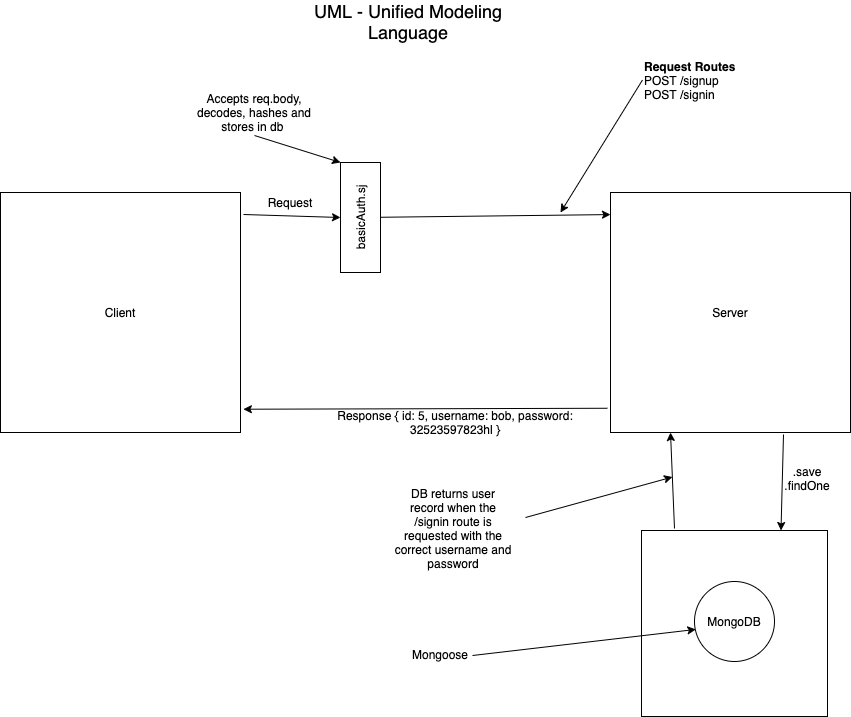

# LAB - Class 06

## Project: Basic Auth

### Author: Simon Panek

#### Contributors: Ricardo, Nathan, Mariko, Tina, & Garrett

### Links and Resources

- [GitHub Actions ci/cd](https://github.com/simon-panek/basic-auth/actions)
- [Heroku Deployment](https://simonpanek-basic-auth.herokuapp.com/)

### Setup

#### `.env` requirements (where applicable)

- `PORT` - 3000
- `MONGODB_URI` - mongodb://localhost:27017/auth

#### How to initialize/run your application (where applicable)

- `npm start`
- `npm test`

- Endpoints
  - `/signup` --> Sends a user name and password to the db
  - `/signin`--> Returns a user record when their username and password is provided

#### Tests

- Tests that the authorization middleware functions

#### UML

